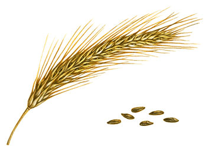

[ ](https://app.codeship.com/projects/181988)



# rye
A simple library to support http services. Currently, **rye** provides a middleware handler which can be used to chain http handlers together while providing statsd metrics for use with DataDog or other logging aggregators. In addition, **rye** comes with various pre-built middleware handlers for enabling functionality such as CORS and rate/CIDR limiting.

## Setup
In order to use **rye**, you should vendor it and the **statsd** client within your project.

```
govendor fetch github.com/cactus/go-statsd-client/statsd

# Rye is a private repo, so we should clone it first
mkdir -p $GOPATH/github.com/InVisionApp
cd $GOPATH/github.com/InVisionApp
git clone git@github.com:InVisionApp/rye.git

govendor add github.com/InVisionApp/rye
```

## Why another middleware lib?

* `rye` is *tiny* - the core lib is ~140 lines of code (including comments)!
* Each middleware gets statsd metrics tracking for free
* We wanted to have an easy way to say “run these two middlewares on this endpoint, but only one middleware on this endpoint” 
    * Of course, this is doable with negroni and gorilla-mux, but you’d have to use a subrouter with gorilla, which tends to end up in more code
* Bundled helper methods for standardising JSON response messages
* Unified way for handlers and middlewares to return more detailed responses via the `rye.Response` struct (if they chose to do so); this functionality allows you to easily "share" state between your custom middleware handlers!
* Pre-built middlewares for things like CORS support

## Writing custom middleware handlers

You can find a complete working example [here](example/rye_example.go).

Begin by importing the required libraries:

```go
import (
    "github.com/cactus/go-statsd-client/statsd"
    "github.com/InVisionApp/rye"
)
```

Create a statsd client (if desired) and create a rye Config in order to pass in optional dependencies:

```go
config := &rye.Config{
        Statter:          statsdClient,
        StatRate:         DEFAULT_STATSD_RATE,
}
```

Create a middleware handler. The purpose of the Handler is to keep Config and to provide an interface for chaining http handlers.

```go
middlewareHandler := rye.NewMWHandler(config)
```

Build your http handlers using the Handler type from the **rye** package.

```go
type Handler func(w http.ResponseWriter, r *http.Request) *rye.Response
```

Here are some example (custom) handlers:

```go
func homeHandler(rw http.ResponseWriter, r *http.Request) *rye.Response {
    fmt.Fprint(rw, "Refer to README.md for auth-api API usage")
    return nil
}

func middlewareFirstHandler(rw http.ResponseWriter, r *http.Request) *rye.Response {
    fmt.Fprint(rw, "This handler fires first.")
    return nil
}

func errorHandler(rw http.ResponseWriter, r *http.Request) *rye.Response {
    return &rye.Response {
                StatusCode: http.StatusInternalServerError,
                Err:        errors.New(message),
    }
}
```

Finally, to setup your handlers in your API (Example shown using [Gorilla](https://github.com/gorilla/mux)):
```go
routes := mux.NewRouter().StrictSlash(true)

routes.Handle("/", middlewareHandler.Handle([]rye.Handler{
    a.middlewareFirstHandler,
    a.homeHandler,
})).Methods("GET")

log.Infof("API server listening on %v", ListenAddress)

srv := &http.Server{
    Addr:         ListenAddress,
    Handler:      routes,
}

srv.ListenAndServe()
```

## Using built-in middleware handlers

Rye comes with various pre-built middleware handlers. Pre-built middlewares  source (and docs) can be found in the package dir following the pattern `middleware_*.go`.

To use them, specify the constructor of the middleware as one of the middleware handlers when you define your routes:

```go
// example
routes.Handle("/", middlewareHandler.Handle([]rye.Handler{
    rye.CORS(), // to use the CORS middleware (with defaults)
    a.homeHandler,
})).Methods("GET")

OR 

routes.Handle("/", middlewareHandler.Handle([]rye.Handler{
    rye.NewCORS("*", "GET, POST", "X-Access-Token"), // to use specific config when instantiating the middleware handler
    a.homeHandler,
})).Methods("GET")

```

### Middleware list

| Name                       | Description                           |
|----------------------------|---------------------------------------|
| [CORS](middleware_cors.go) | Provide CORS functionality for routes |
| [JWT](middleware_jwt.go)   | Provide JWT validation                |

## API

### Config
This struct is configuration for the MWHandler. It holds references and config to dependencies such as the statsdClient.
```go
type Config struct {
    Statter          statsd.Statter
    StatRate         float32
}
```

### MWHandler
This struct is the primary handler container. It holds references to the statsd client.
```go
type MWHandler struct {
    Config Config
}
```

#### Constructor
```go
func NewMWHandler(statter statsd.Statter, statrate float32) *MWHandler
```

#### Handle
This method chains middleware handlers in order and returns a complete `http.Handler`.
```go
func (m *MWHandler) Handle(handlers []Handler) http.Handler
```

### rye.Response
This struct is utilized by middlewares as a way to share state; ie. a middleware can return a `*rye.Response` as a way to indicate that further middleware execution should stop (without an error) or return a hard error by setting `Err` + `StatusCode`.
```go
type Response struct {
    Err           error
    StatusCode    int
    StopExecution bool
}
```

### Handler
This type is used to define an http handler that can be chained using the MWHandler.Handle method. The `rye.Response` is from the **rye** package and has facilities to emit StatusCode, bubble up errors and/or stop further middleware execution chain.
```go
type Handler func(w http.ResponseWriter, r *http.Request) *rye.Response
```

## Test stuff
All interfacing with the project is done via `make`. Targets exist for all primary tasks such as:

- Testing: `make test` or `make testv` (for verbosity)
- Generate: `make generate` - this generates based on vendored libraries (from $GOPATH)
- All (test, build): `make all`
- .. and a few others. Run `make help` to see all available targets.
- You can also test the project in Docker (and Codeship) by running `jet steps`
